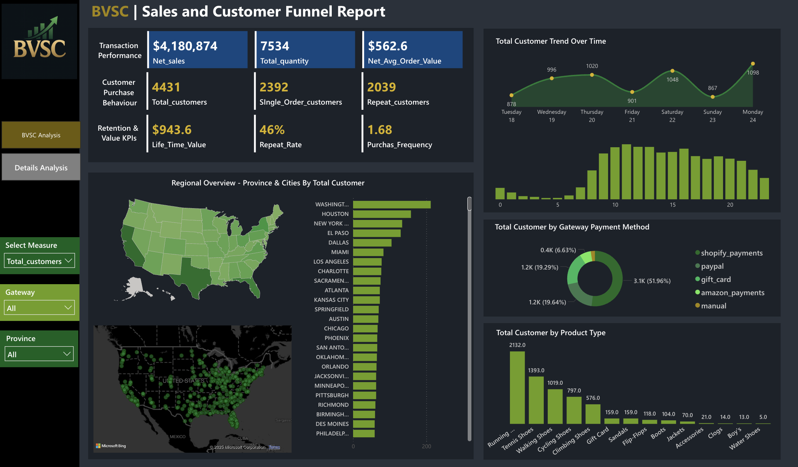
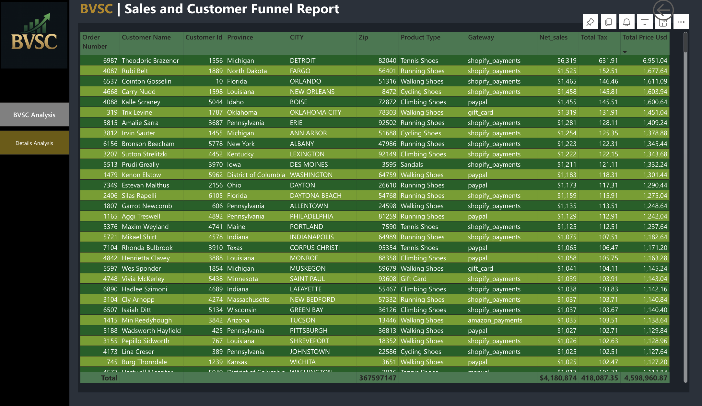
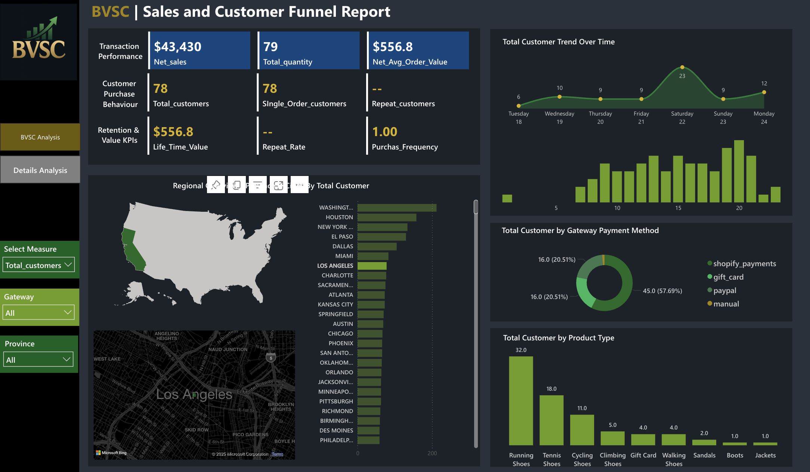
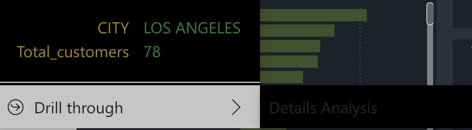
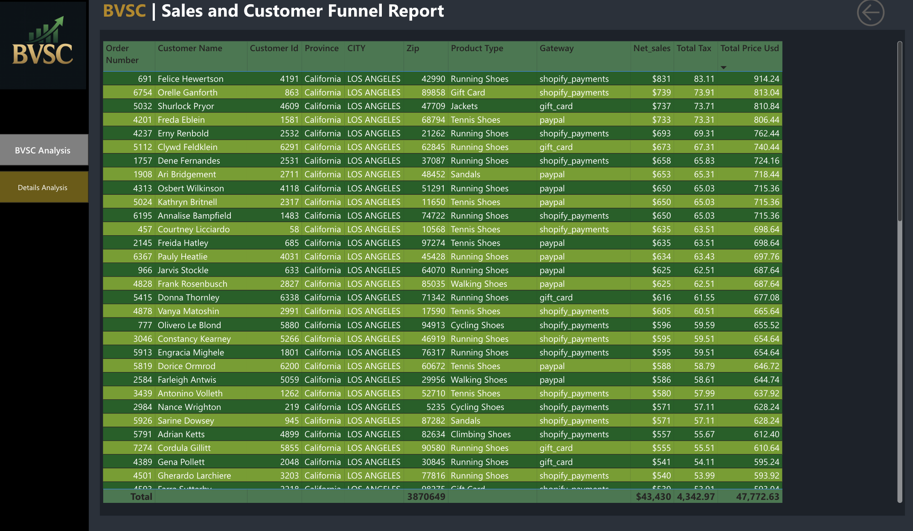

# 📊 BVSC Sales & Customer Funnel Analysis | Power BI Dashboard

This project presents an end-to-end **data analytics and reporting solution** for BVSC, covering the full spectrum from **data engineering and ETL pipeline design** to **interactive dashboard visualization in Power BI**. The goal was to deliver timely, actionable insights into weekly sales trends, customer retention, product performance, and payment behaviors.

---

## 🧠 Project Summary

- 🔗 Built an automated **data pipeline** to extract and process retail sales data from operational systems
- 🧹 Cleaned, transformed, and loaded the data into **Amazon Redshift**
- 🔁 Implemented **incremental data refresh** to update insights weekly
- 📊 Developed an **interactive Power BI dashboard** with dynamic filters, DAX measures, and drill-through capabilities


---

## 🏗️ Data Engineering Pipeline (ETL)

The backend for this dashboard was powered by a custom ETL pipeline developed using **Python and SQL**, orchestrated for weekly updates. Here's a breakdown:

### 🔧 Tools & Services Used:
- **Amazon Redshift** – Data warehouse used to store cleansed and aggregated sales data
- **AWS S3** – Staging layer for raw data ingestion (optional)
- **Python + SQL** – Used for data transformation, deduplication, and enrichment
- **Power BI** – Connected directly to Redshift for live query and import mode

### 🔄 Incremental Refresh Strategy:
- Implemented a **date-partitioned load** using Redshift SQL scripts
- Weekly job runs check for new data using `last_updated` column
- Power BI set up with **incremental refresh policy** on the dataset:
  ```text
  RangeStart = Today() - 90 days
  RangeEnd   = Today()
  ```
- This improves performance and ensures near real-time insights

---

## 📊 Dashboard Features

| Section                         | Description |
|--------------------------------|-------------|
| **KPI Cards**                  | Net Sales, Quantity, Avg Order Value, LTV, Repeat Rate, Frequency |
| **Customer Trend**            | Visualizes customer volume by day of week |
| **Regional Insights**         | Province and City-level breakdown of customers |
| **Product Insights**          | Popular product categories by volume |
| **Payment Method Analysis**   | Gateway usage: Shopify, PayPal, Amazon Pay, Gift Card |

---

## 🧮 DAX Measures (Selected)

Custom measures were built using DAX to compute KPIs:

- `Net Sales = SUM('SalesData'[Net_sales])`
- `Average Order Value = [Net Sales] / DISTINCTCOUNT('SalesData'[Order_Number])`
- `Repeat Rate = CALCULATE(... using FILTER for multiple orders)`
- `LTV = AVERAGEX(... per customer)`
- `Purchase Frequency = Orders / Customers`

All measures follow **best practices** in DAX for performance and reusability.

---

## 🧭 Filters & Slicers

- **Product Type**
- **Payment Gateway**
- **City & Province**
- **Customer Type**: Single vs Repeat
- **Time Window**: Day-wise breakdown (Tue–Mon)

---

## 🎯 Advanced Features

- ✅ **Drill-through pages** for city, product, and customer-level analysis
- 🧠 Smart **tooltips** with additional metrics
- 🔗 Page-level and report-level filters
- 🧩 Optimized for both Import and DirectQuery modes



---

## 📂 Repository Structure

```plaintext
bvsc-sales-analysis/
├── README.md
├── report/
│   └── BVSC_Analysis_Vivek.pdf
├── powerbi/
│   └── bvsc_dashboard.pbix          # Optional: Power BI source file
├── data/
│   └── sample_sales_data.csv        # Optional: Cleaned dataset snapshot
├── assets/
│   └── dashboard_preview.png        # Optional: Image for GitHub preview
```

---

## 📌 Key Business Insights

- 🧾 46% of customers were repeat buyers — indicating strong loyalty
- 🛍️ Running Shoes, Tennis Shoes dominate sales
- 🏙️ New York City and Albany are top-performing markets
- 💳 Shopify Payments leads, followed by PayPal and Amazon

---

## 🚀 How to Run

1. Clone the repo:
   ```bash
   git clone https://github.com/yourusername/bvsc-sales-analysis.git
   cd bvsc-sales-analysis
   ```
2. Open `powerbi/bvsc_dashboard.pbix` in **Power BI Desktop**
3. If needed, update data source credentials for **Amazon Redshift**
4. Explore or modify visuals, DAX measures, and filters

---

## 🙋‍♂️ Author

**Vivek Sai Chinna Burada**  
 Data Engineer | BI Developer | GenAI Enthusiast  
 Charlotte, NC | Fremont, CA  
 [LinkedIn]([https://www.linkedin.com/in/your-profile](https://www.linkedin.com/in/vivek-sai-chinna-burada-a50873215/))  
 viveksaichinnaburada@gmail.com  

---

## 📝 License

This project is licensed under the [MIT License](LICENSE).
